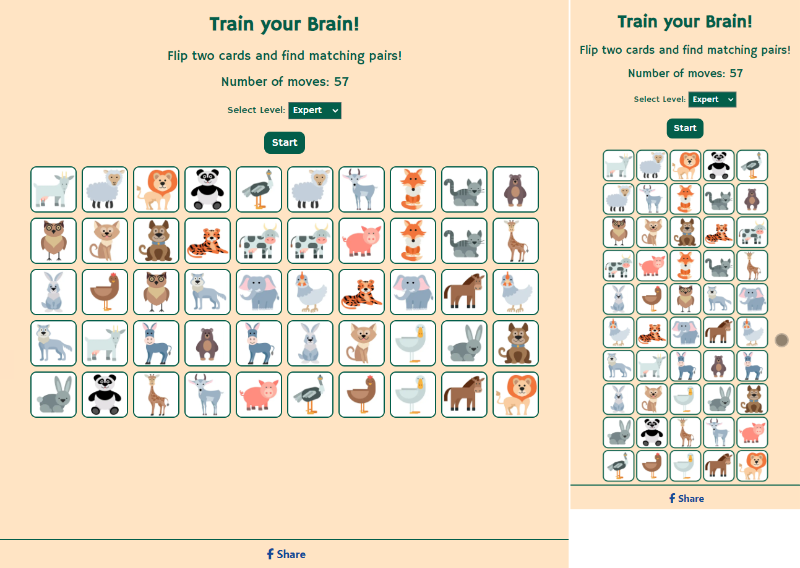

# Train your brain

## Introduction

### Project Description

[Train your brain](https://claudiainsweden.github.io/train-your-brain/) is a memory card game with four difficulty levels. The matching cards are to be found by flipping two cards and remember which cards are placed where to find matching pairs. Matched pairs will remain visible. When the user has found all matching pairs, the game is over.

### Project Purpose

A memory game is a fun way to train concentration and focus, and is suitable for people of all ages. 

## User stories

User story: As a user, I want to play a funny game.

End user goal: The user can play a game.

End business goal: The user plays the game.

User story: As a user, I can easily start a new game.

End user goal: User can restart the game by clicking on a restart button.

End business goal: The user plays multiple games.

User story: As a user, I want to see how many moves it took to find all matches.

End user goal: User can see how many moves it took to finalize the game.

End business goal: The user restarts the game to reach a higher score.

User story: As a user, I want to be able to decide how hard the game should be.

End user goal: User can select difficulty levels.

End business goal: The user can select how many cards the game should include.

User story: As a user, I want to share this game to my Facebook friends.

End user goal: User can easily share the game on Facebook.

End business goal: The user shares the game to friens who share it to their friends, who in their turn share it with their friends, and so on. 

## Features

### Home

The game consists of one page only including a footer with a Facebook Share button.
Underneath the title a very short instruction is visible as well as the moves counter, a difficulty selection box and the start button.

### Game area

The game board is pre-populated with 12 cards/6 pairs which corresponds to the easy level. This to enable the user to start playing directly when visiting the page.

The cards are flipped so that the backside with paw-prints is visible. The front contains images of animals so that the game is also appealing to children.

There are totally 25 cards available. Before a new game starts, all 25 cards are shuffled. Then, the number of cards according to the selected difficulty level is extracted, duplicated and shuffled once more before the game board is populated.

On small screens the game board consists of 4 columns, respective 5 columns for Expert level; and on large screens of 6 columns, respective 10 columns for Expert level. 
The game is designed for screens as small as 300px.

Easy level consists of 12 cards/6 pairs

Medium level consists of 24 cards/12 pairs

Hard level consists of 36 cards/18 pairs

Expert level consists of 50 cards/25 pairs

The user starts the game by flipping the first card to see the animal on the front. When the user clicks on a second card, the cards will be compared with each other. When the cards match, that is if they show the same animal, the cards will remain flipped and stay visible to the user throughout the rest of game. 
If the cards don't match, the cards will be unflipped and the user may continue flipping cards to find matches.

The board will lock when two cards have been flipped to avoid that more than 2 cards can be selected. The flipped cards will be visible for one second before they are unflipped.

Each time the user flips two cards, the moves-counter on top of the game board will increase by 1.

When the user has found all matching pairs, a dialog box will pop-up with the message "Congratulations! You found all matches! Well done!" including the animated "Partying-face" emoji. When the user clicks on the Close-button, the dialog box will be closed and the user can select a different level and start a new game by clicking the button "Start". 

To avoid accidential restarts during a game, the user will need to confirm that a new game should start. 

When the user confirms, the moves-counter will be reset to 0 and a new game board will be populated with the number of cards corresponding to the selection in the difficulty selection box.

### Footer

The sticky footer contains a Facebook share-button that opens a news feed window on Facebook, showing a preview of the game and the link to the game when the user is logged in to Facebook. If this is not the case, the Facebook Log-in page will be displayed. 

### 404

A customized 404 page with a link to the game was created to avoid frustrated users when something's going wrong. Following the animals-theme from the game, the page also displays the animated emoji "Scream-cat".

## Future Features

While the current version is fully functional and entertaining, there are some ideas for future development:

- Let user choose different topics for the front cards
- Add instructions
- Add sound effect when the user wins a game
- Add possibility for the user to save the score

## Color scheme

The color scheme was selected as it's calm and doesn't distract the user from the images that shall be matched. 

**White** 
_"White is clean, simple, and pure. It stands in stark opposition to black, and its meanings are unequivocal. As white light contains all the colors of the spectrum, it’s an inclusive, impartial color, favoring no single hue and refusing to take sides."_ 
_[Source of description for "white"](https://www.sensationalcolor.com/meaning-of-white/)_ 
Here white is used as high contrast text color against the dark Castleton Green of buttons and the selected difficulty levels.

**Castleton Green** 
_"Castleton Green is a deep, rich green color, resembling the color of Castleton tea leaves. It's a classic and timeless color, ideal for creating a traditional and elegant ambiance."_ 
_[Source of description for "castleton green"](https://colors.muz.li/color/castleton-green)_ 
Castleton Green also resembles nature and fits well with the animal theme of the cards. It's used for text, as background for buttons and as border for the cards.

**Champagne** 
_"Named after the bubbly beverage, champagne is a mixture of yellow and orange and closely resembles beige. Sitting on the inner, paler portion of the color wheel, the warmth of orange mellows the brightness of yellow in it.
Champagne brings to mind the effervescence of the drink. Because the drink is usually consumed in happy events like weddings or New Years, it also evokes feelings of joy."_  
_[Source of description for "champagne"](https://www.canva.com/colors/color-meanings/champagne/)_ 
Of course our Memory Game also bring joy to the users. Therefore, champagne is used as background color.

**Tawny** 
_"Tawny comes from the Anglo-Norman word, taune, which means tanned. Although you might think first of sun tans, which do indeed produce tawny colors in light-skinned people (as long as they don't go straight to lobster red), tan first meant the bark of an oak tree, used to cure leather. It's from the look of tanned leather that we get skin tans and the word tawny."_ 
_[Source of description for "tawny"](https://www.vocabulary.com/dictionary/tawny)_ 
In this game we use tawny as border color for the dialog boxes so that they stand out clearly agains the game in the background. It's also the color of the paws print on the card backside.

## Font
_"Hammersmith One is a very low contrast typeface inspired by the Johnston UK lettering tradition. Hammersmith One shows the quirks of a somewhat naive, handmade, brush written letters including a wider than normal "e" and "s" as well as dark joins between stroke which are normally compensated for in type. The sources for this design have been adapted not just for type but specifically for use as a web type. This font works well to even smaller sizes than was originally expected."_ 
The font was chosen as it provides very well readability in all sizes, looks very clean but still has a playful touch to it.

"Hammersmith One" from [Google Fonts](https://fonts.google.com/).

## Layout
The layout was kept very simple. Main focus is on playing a game that requires concentration, at least when playing the hard or extrem level.  
One challenge was to avoid the necessity for scrolling for expert level but still keeping a reasonable card size. I solved this by using 25 pairs/50 cards and dynamically change the game board to 5 columns for small screens respective 10 columns for larger screens.

## Technology

- IDE: [GitPod](https://www.gitpod.io/)
- Repository: [GitHub](https://github.com/)
- Image editor: [SnagIt](https://www.techsmith.com/screen-capture.html)
- Image converter: [Birme](<https://www.birme.net/>)
- Favicon generator: [Favicon](https://favicon.io/)
- Image background remover: [Adobe Express](https://www.adobe.com/express/feature/image/remove-background)
- Color Scheme: [Coolors](https://coolors.co/?home)
  
## Testing

### Validator Testing

#### HTML

No errors were returned when passing through the [W3C Markup validator](https://validator.w3.org/).

#### CSS

No errors were found when passing through the [W3C CSS Validator](https://jigsaw.w3.org/css-validator/) validator.

#### JavaScript

No error were found when passing through [JSHint](<https://jshint.com/>) JavaScript Code Quality Tool.
However, the two card arrays were marked as undefined variables, see screenshot.

#### Google Chrome Lighthouse Reports

The report presents the result of Lighthouse testing to assess the performance, accessibility, best practices and SEO of [Train your brain](https://claudiainsweden.github.io/train-your-brain/).

The tests were executed using the Google Chrome browser's DevTools.
The site scores very high in all areas.

### Manual Testing

#### Features Testing

| Feature  | Action |Result|
| ------------- | ------------- |-------------|
|**Cards**|
| Backside card 1	  | Click  | Flips card, image visible|
| Backside card 2  | Click  | Flips card, image visible |
| Cards 1 & 2   | Match  | Both cards remain flipped with image visible |
| Card 1  | Click when already matched   | Unflips but flips right after, image visible |
| Card 2  | Click when already matched  | Unflips but flips right after, image visible |
| Cards 1 & 2| No match  | Both cards unflip after one second, image not visible |
| Backside card 3  when cards 1 & 2 are flipped  but do not match| Click | Not possible to flip more than two cards |
| **Number of moves** |  | |
| Moves-ccounter  | Counter| Counter increments by one for each matching pair of cards|
| Moves-ccounter	| Click outside of game board |Does not increment the moves-counter |
| **Difficulty Level**	|  ||
| Select box | Display | On first page load the option Easy is selected |
| Select box | Click | Click into select box opens a dropdown menu with four options: Easy, Medium, Hard, Expert |
| Select box | Click | Click on option Easy shows Easy as selected|
| Select box | Click | Click on option Medium shows Medium as selected|
| Select box | Click | Click on option Hard shows Hard as selected|
| Select box | Click | Click on option Expert shows Expert as selected|
| Start Button | Click | Displays a dialog box asking to confirm that a new game shall start. The area behind the dialog box is faded and cannot be clicked. |
| New Game-button in dialog box	| Click | Depending on the selected difficulty level and screen size the game board is populated as follows: |
| 	| Level Easy | Screen size < 992px: 4 columns, 3 rows  Screens size > 992px: 6 columns, 2 rows |
| 	| Level Medium | Screen size < 992px: 4 columns, 6 rows  Screens size > 992px: 6 columns, 4 rows |
| 	| Level Hard | Screen size < 992px: 4 columns, 9 rows  Screens size > 992px: 6 columns, 6 rows |
| 	| Level Expert | Screen size < 992px: 5 columns, 10 rows  Screens size > 992px: 10 columns, 5 rows |
| Cancel-button in dialog box | Click  |Closes the dialog box and leaves the game in its present state, showing matches and/or flipped cards and number of moves|
| **Game won** | 	| |
| All card pairs matched  | Dialog box  |A dialog box appears with the text "Congratulations! You found all matches! Well done!" and a animated "Partying-face" emoji. The area behind the dialog box is faded and cannot be clicked.|
| Close-button in dialog box  | Click | Closes the dialog box, game board shows all matched cards and number of moves |
| **Footer**  |  | |
| Facebook Icon & Share  | Click |Opens a Facebook news feed window with a link to the game in a new tab|

## Browser Testing

Functionality, links, layout, and responsiveness were tested with the following browsers without any issues:

- Microsoft Edge Version 124.0.2478.105
- Firefox Version 124.0.2
- Brave Version 1.65.123
- Google Chrome Version 124.0.6367.91
  
## Device Testing

Functionality, links, layout, and responsiveness were tested on the following devices without any issues:

- Lenovo Legion Slim 7 / 2560px x 1600px
- Dell Screen 24" / 1920px x 1080px
- Samsung Galaxy S22 Ultra 

### Bugs

1. Originally I used a json file to load the images into the game. This worked perfectly fine during development. However, the images would not load on the live site. I tried to find a solution but according to some posts on Stack Overflow you would need to load the json file from an external server. To keep it simple I just added the images to an array.

2. When the game was near to be finished I realized that the game board would be empty on the first page load. As this is not a good user-experience, I decided to pre-populate the selected cards array with 6 cards.

## Deployment

The site was deployed to GitHub pages. The steps to deploy are as follows:

- In the GitHub repository, navigate to the Settings tab
- From the source section drop-down menu, select the Main Branch
- Once the main branch has been selected, the page will be automatically refreshed with a detailed ribbon display to indicate the successful deployment.
  
The live link can be found here - <https://claudiainsweden.github.io/train-your-brain/>

## Forkning

A fork is a new repository that shares code and visibility settings with the original repository.
 You're welcome to do so. Please refer to the official GitHub documentation on how to fork my repository. 
[Link to the GitHub Documentation](https://docs.github.com/en/pull-requests/collaborating-with-pull-requests/working-with-forks/fork-a-repo#forking-a-repository) 
[Link to the Train your Brain Repository](https://github.com/ClaudiaInSweden/train-your-brain)

## Cloning

Cloning a repository pulls down a full copy of all the repository data that GitHub.com has at that point in time, including all versions of every file and folder for the project. 
 You're welcome to do so. Please refer to the official GitHub documentation on how to clone my repository. 
[Link to the GitHub Documentation](https://docs.github.com/en/repositories/creating-and-managing-repositories/cloning-a-repository) 
[Link to the Train your Brain Repository](https://github.com/ClaudiaInSweden/train-your-brain)

## Credits

### Content

Inspiration came from research on LinkedIn where former Code Institute students published their PP2 projects and because I myself like to play memory.

### Media

All images, icons and illustrations are from free sources as listed below:

- Emoji for for Favicon from [Twemoji](https://twemoji.twitter.com/)
  
  Licensing:
<https://creativecommons.org/licenses/by/4.0/>
- Favicon Converter from [Favicon](https://favicon.io/)
- Fonts from [Google Fonts](https://fonts.google.com/)
- Images converted to webp with [Birme](https://www.birme.net/)
- Images for cards from [Macrovector on Freepik](https://www.freepik.com/free-vector/wild-home-animals-set_4005528.htm)
- Paw image for back side of cards from [Vectorstock](https://www.vectorstock.com/royalty-free-vector/a-footpath-trail-dog-prints-walking-randomly-vector-33704528)
- Animated emojis on 404 page and game won dialog box from [Animated Emoji](https://googlefonts.github.io/noto-emoji-animation/)

### Code

The following tutorials and websites were used for inspiration and guidance:

- Memory game board: [freeCodeCamp.org](https://www.youtube.com/watch?v=ZniVgo8U7ek)
- Memory game: [JavaScriptAcademy](https://youtu.be/xWdkt6KSirw?si=gYekWZV2OPfj7r0K)
- Window: confirm() method: [MDN Web Docs](https://developer.mozilla.org/en-US/docs/Web/API/Window/confirm)
- Difficulty level: [Memory Master](https://natashary.github.io/memory-game/)
- HTML dialog element: [Web Dev Simplified Blog](https://blog.webdevsimplified.com/2023-04/html-dialog/)
- Match multiple media queries: [JavaScript Kit](http://www.javascriptkit.com/javatutors/matchmediamultiple.shtml)

as well as

- [W3Schools](https://www.w3schools.com/)
- [Mdn Web Docs](<https://developer.mozilla.org/en-US/>)
- [Stack overflow](https://stackoverflow.com/)
- [Medium](https://medium.com/)
- [GeeksforGeeks](https://www.geeksforgeeks.org/)
- Code Institute Slack Channel
